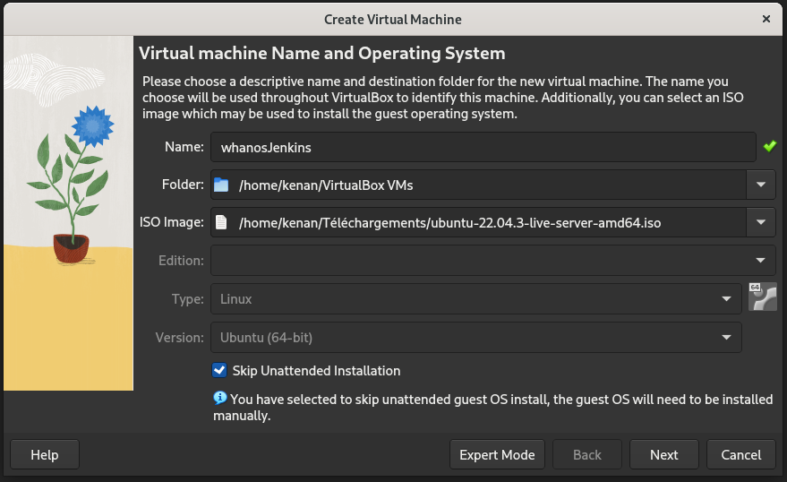
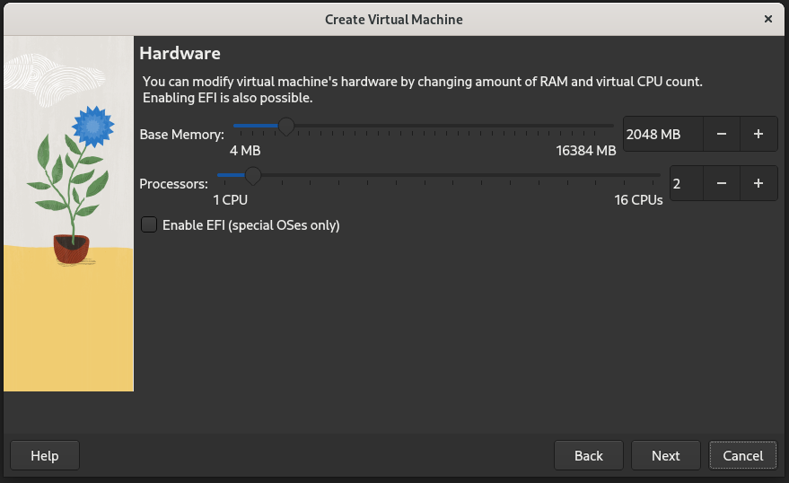
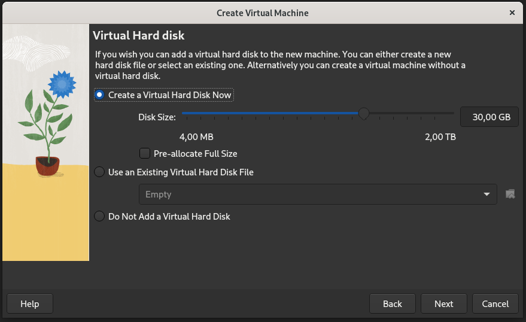
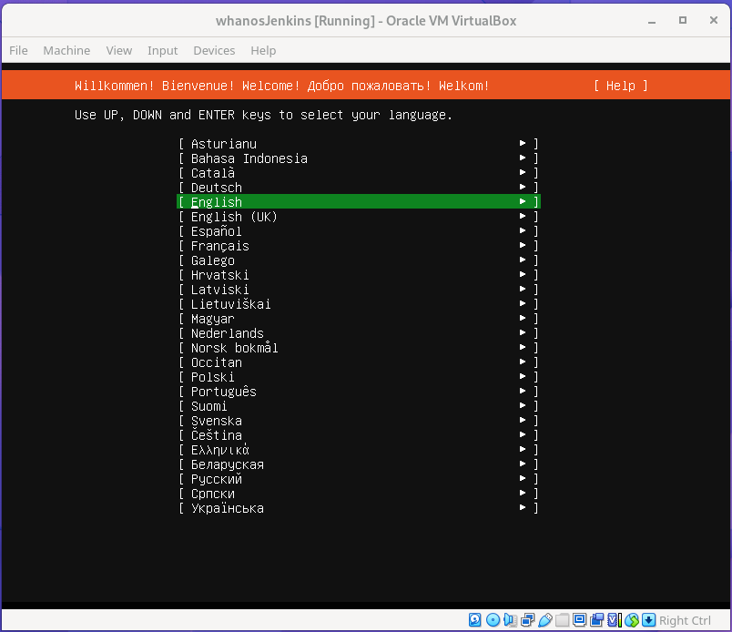
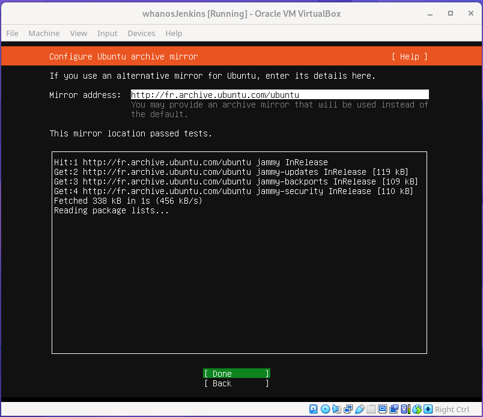
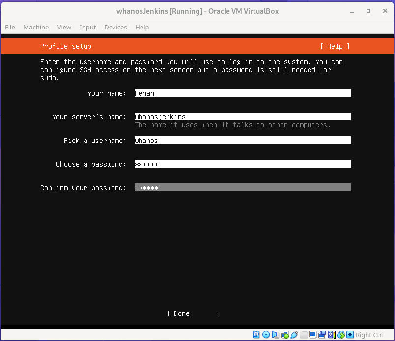
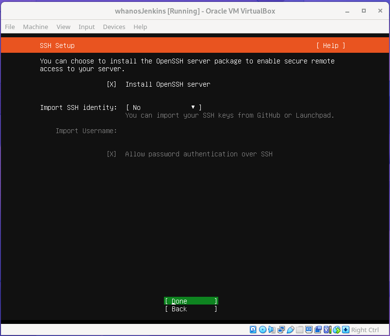
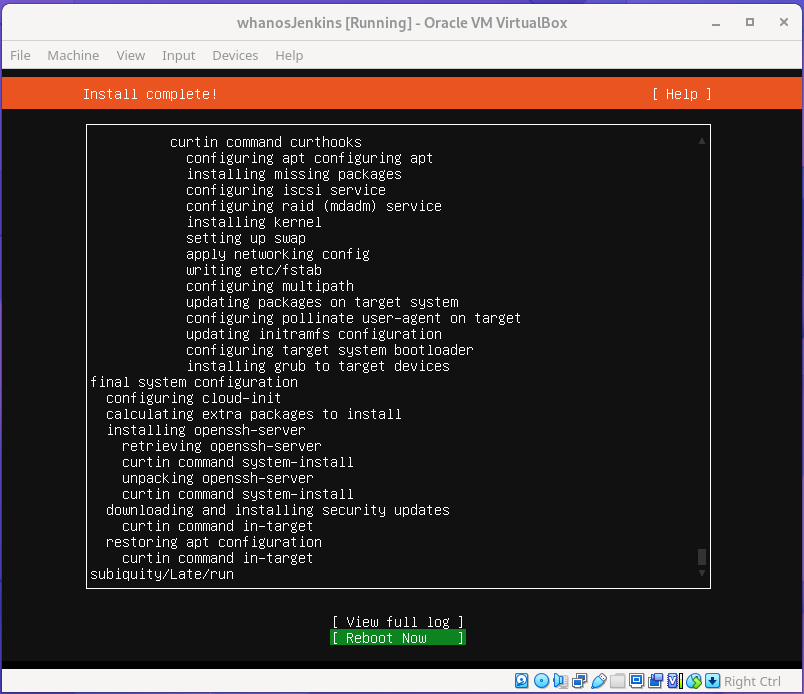
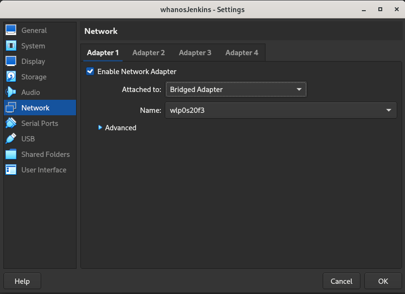
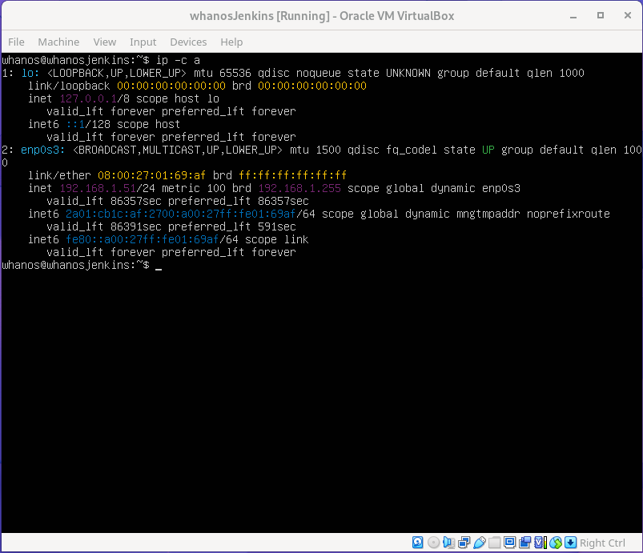

# Install

## Requirements

- Git
- Ansible
- At least 3 VMs with the setup described in [VMs setup](#vms-setup)

## VMs setup

For the setup I used VirtualBox but it should work with any other virtualization software until your VMs have the required configuration.

### VMs requirements

This requirement are the minimum requirements for the VMs. You can use more powerful VMs if you want.

Jenkins VM:

- 2 CPU
- 2 GB RAM (2048 MB)
- 30 GB disk

Kubernetes VMs:

- 4 CPU
- 4 GB RAM (4096 MB)
- 30 GB disk

### Create the VMs

Create 1 VM for Jenkins and at least 2 VMs for the Kubernetes cluster.

#### Creating a VM with VirtualBox

- Open VirtualBox
- Click on "New"
- Name your VM
- Select your "ISO Image" (Ubuntu server 22.04.3 LTS in my case)

- Click on "Next"
- Set the memory size and CPU number according to [VMs requirements](#vms-requirements)

- Click on "Next"
- Select "Create a virtual hard disk now"
- Set the disk size according to [VMs requirements](#vms-requirements)

- Click on "Next"
- Then click on "Finish"

#### Installing Ubuntu server

- Start your VM
- Select your language

- Select "Continue without updating"
- Then select "Done" until you reach the "Configure Ubuntu archive Mirror" screen

- Wait to see if the mirror location pass the test
- If the test pass, select "Done", otherwise you may have an issue with your internet connection
- Select "Done" until you reach the "Storage configuration" screen
- Select "Done" and then "Continue" on the "Confirm destructive action" screen

You should now be on the "Profile setup" screen.

- Enter your name
- Enter your server name
- Enter your username (For all Kubernetes VMs, use the same username)
- Enter your password (For all Kubernetes VMs, use the same password)

- Select "Done"
- Select "Continue" (We don't need Ubuntu Pro)
- Check "Install OpenSSH server"

- Select "Done"

You should now be on the "Featured server snaps" screen.

Check nothing and select "Done".

<!--  -->

Now wait for the installation to finish.

- Select "Reboot now" and then "Done"

- Wait for the VM to reboot
- Login with your username and password
- Run `shutdown -h now` to shutdown the VM

- Now go to the VM settings
- Go to "Network"
- And change the "Attached to" to "Bridged Adapter"

- Start the VM
- Login with your username and password
- Run `ip -c a` to get the IP address of your VM

Now repeat the same steps for the other VMs.
