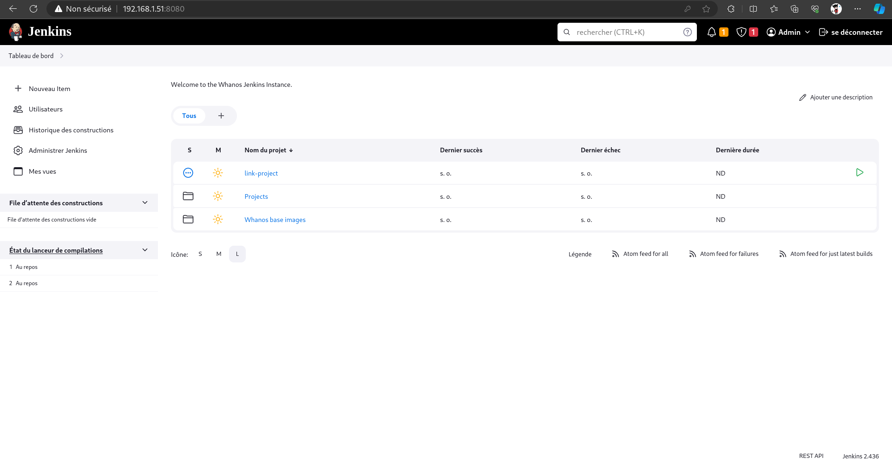
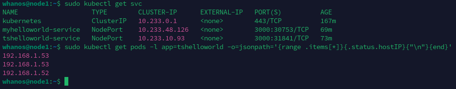
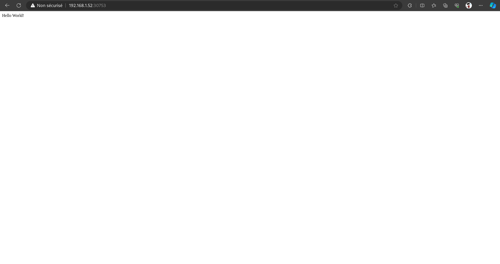

# How to use

## Jenkins

- Go to the Jenkins VM IP address in your browser on port 8080
- The username is `admin` and the password is the one you entered during the VM setup

- You can now see all the jobs
- In the "Whanos Base Image" folder you can find the job to build the base image
- In the "Projects" folder you can find the jobs to build the projects created with the "link-project" job

## Kubernetes

- Once the Jenkins jobs are finished, you can connect to one of the Kubernetes VMs
- Run `sudo kubectl get svc` to find the port on which the application is listening
- Run `sudo kubectl get pods -l app=YOURAPPNAME -o=jsonpath='{range .items[*]}{.status.hostIP}{"\n"}{end}'` to get the IP address of the VM on which the application is running (replace YOURAPPNAME with the name of your application)

- Go to the IP address of the VM on which the application is running on the port you found earlier
- You should see your application

