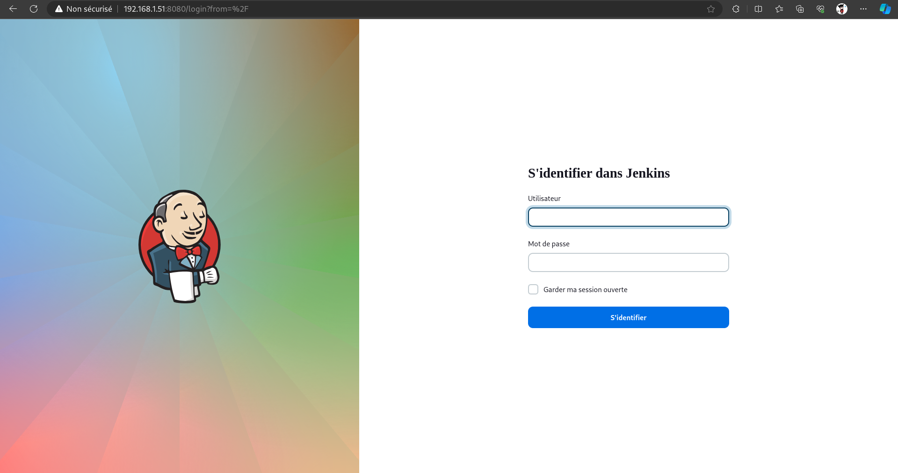
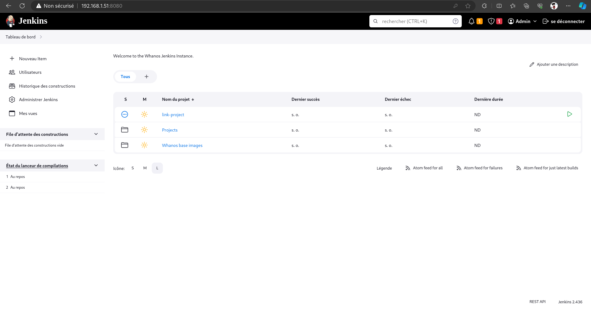

# Jenkins Usage

## Jenkins Access

- Go to the Jenkins VM IP address in your browser on port 8080
- The username is `admin` and the password is the one you entered during the VM setup

- You can now see all the jobs
- In the "Whanos Base Image" folder you can find the job to build the base image (see [Whanos Images](#whanos-images))
- In the "Projects" folder you can find the jobs to build the projects created with the "link-project" job (see [Link Project](#link-project))

## Whanos Images

Jenkins is linked to a docker registry (Docker Hub).
When building the whanos base images (`whanos-<language>`), Jenkins will trigger a `docker build` command
that will generate the base image for the selected languages and then **push** it into the registry.

Supported languages are:

- C
- Java
- JavaScript
- Python
- Befunge

## Link Project

Jenkins is able to track a given `git` project.

Under the listed jobs, select `link-project` and trigger it with arguments.
Name the project you want to track and give Jenkins its URI.

Now the project is tracked by Jenkins, it will be pulled every minute and check the latest available commit to detect changes.

Upon changes the project will be built according to the presence of a Dockerfile in the root folder.
If a Dockerfile is found, the project will be built using it. Else, Whanos will detect which language is the project based on and use one of the standalone images for this language.

The resulting image will be hosted on the local Docker Registry used by Whanos.

### Deployment

You can make Jenkins deploy your application project on Kubernetes.

In order to do it, you must provide at the root of your project a `whanos.yml` file that contains the configuration for your deployment.

After your image is built, Jenkins will search the root folder for the `whanos.yml`. If it finds it, an order will be issued to deploy your application using the built image. Otherwise the pipeline is considered done and successful.
